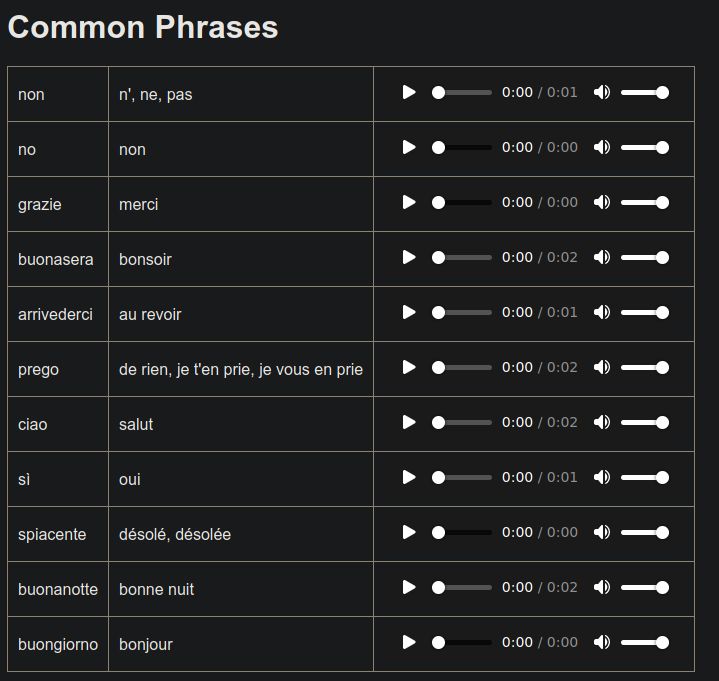

# Duolingo-Word-List-Generator

A simple script to generate a word list from Duolingo for easy vocabulary review.

It contains:
- the word in the language you are learning
- the translation 
- the pronunciation (audio)

## Installation

```bash
$ pip install duolingo-api
```

Then Configure `config.example.json` and rename it to `config.json`

## Example



## Discord

Join the Discord server !

[](https://discord.gg/sPvJmY7mcV)

## Contributing
Pull requests are welcome. For major changes, please open an issue first to discuss what you would like to change.

Please make sure to update tests as appropriate.

## License

This project is under [GPLv3](https://github.com/Darkempire78/DeezerDownloader-Discord-Bot/blob/master/LICENSE).
